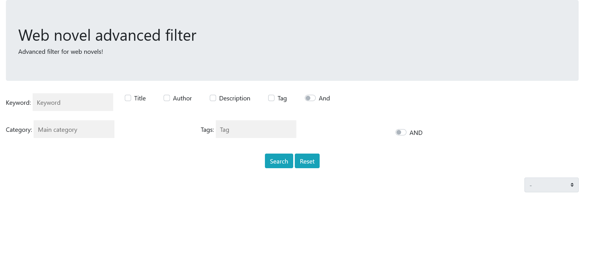
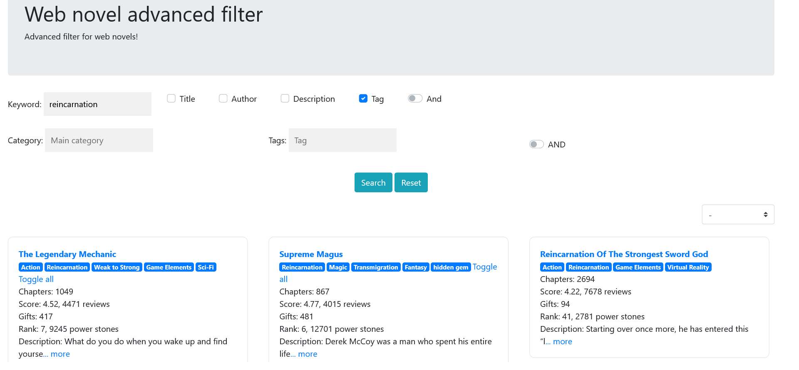

# WebNovelTagsSearch

A site that needs to be used in together with [WebNovelGrabber](https://github.com/DeeJack/Web_Novel_Grabber).
This is the frontend that lets you search from the novels downloaded with the other program.

It allows searching for categories, tags, title, description, and even the exclusion of categories and tags from the results.

## Getting Started

- Add the output obtained from WebNovelGrabber (webnovels.json) in public/documents
- Run with `npm run start`
- Access the webpage from `localhost:9090`

## Technologies used

- NodeJS + Express
- ejs

## Images

